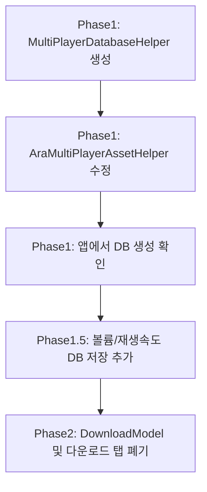

# 멀티플레이어 Realm 제거 및 SQLite 전환 계획

**문서 경로**: `/Users/dalnimbest/Documents/workspace/dalvocaandroid/멀티플레이어_Realm_SQLite_마이그레이션_계획.md`

## 개요

멀티플레이어에서 asset 기반 SQLite를 앱 생성 방식으로 전환하고, **Mac**의 araonesoft.multiplayer.sqlite 스키마를 기반으로 Android에 있는 기능을 추가할수 있다. (iOS는 참조하지 않음) 각 스크린별 **볼륨**과 **재생속도**를 DB에 저장·로드하도록 추가한다. 미완성 구현(DownloadModel, 다운로드 탭 등)은 **폐기**한다.

### 현재 작업 범위 (아라플레이어 Realm은 추후 작업)

**아라플레이어(VideoModel, PlaylistModel 등) Realm 마이그레이션은 나중에 진행. 당분간 해당 내용은 제외.**

| 구분 | 대상 | 처리 |
|------|------|------|
| **현재 작업** | MultiPlayer SQLite 앱 생성 | Phase 1 |
| | AB 반복 DB 저장 | Phase 1.1 |
| | 볼륨·재생속도 DB 저장 | Phase 1.5 |
| | DownloadModel, 다운로드 탭 | **폐기** (Phase 2) |
| **추후 작업** | VideoModel, PlaylistModel, BookmarkPlayerModel, SubModel, VideoSeasonModel, ServerModel, ListenComprehensionModel | 아라플레이어 작업 시 진행 |

---

## 현재 구조 분석

### SQLite (MultiPlayerDatabase) — 현재 상태

- **Helper**: `app/src/araplayer/java/com/dalread/database/sqlite/MultiPlayerDatabaseHelper.java` — 앱에서 CREATE TABLE로 테이블 생성 (asset DB 미의존)
- **DB 접근**: `MultiPlayerDatabase.java` — MultiPlayerDatabaseHelper 사용, DB 없으면 생성
- **초기화**: `AraMultiPlayerAssetHelper.java` — 기존 SQLite DB 파일이 있으면 구 스키마에서 읽어 새 스키마로 복사 후 사용, 없으면 MultiPlayerDatabaseHelper로 빈 DB 생성. (Realm 마이그레이션 없음)
- **실제 사용 테이블**: current_screens, video_meta, stored_layout, screens_in_stored_layout, playlist, playlist_item (아래 "Android 실제 사용 테이블" 참고)
- **제거·미사용**: DIC_PLAYER_* 테이블명/레거시 메서드명 제거 완료. app_kv는 Mac만 구현·모바일에서는 불필요하여 미사용. video_list_in_screen은 video_meta 테이블로 대체. current_screens의 video_list_json 컬럼 제거(앞뒤 목록은 video_meta 기준)

### Realm 사용처 (현재 범위: 폐기만)

| 모델 | 주요 사용처 | 처리 |
|------|-------------|------|
| DownloadModel | (삭제됨) | **폐기 완료** |
| VideoModel, PlaylistModel 등 | (다수) | **추후 작업** (현재 제외) |

### 스키마 기준: Mac만 참조

- **Mac**: current_screens, video_meta, stored_layout, screens_in_stored_layout (ab_loop_json으로 다중 구간)
- **Android**: Mac 스키마를 기준으로 하고, Mac에 없는 컬럼/테이블만 추가 (speed, rotate, hide, playlist 등). 아래 "Mac과 Android 스키마 차이" 참고.

---

## Android 실제 사용 테이블 (현재 스키마)

`MultiPlayerDatabaseHelper.onCreate()` 기준. 모든 컬럼 DEFAULT 지정.

| 테이블 | 컬럼 (PK/인덱스 등) |
|--------|---------------------|
| **current_screens** | screen_id PK, file_path, last_time, ab_loop_json, use_ab, resize_mode, volume, speed, rotate |
| **video_meta** | file_path PK, last_time, ab_loop_json, use_ab, resize_mode, volume, speed, rotate, hide (current_screens 변경 시 같이 반영) |
| **stored_layout** | id PK AUTOINCREMENT, name, created_at, grid_row_count, grid_column_count |
| **screens_in_stored_layout** | id PK AUTOINCREMENT, layout_id, screen_id, file_path, last_time, ab_loop_json, use_ab, resize_mode, volume, sort_order, speed, rotate — 인덱스: layout_id (레이아웃에서 가져왔을 때만 반영) |
| **playlist** | id PK AUTOINCREMENT, name, is_selected, favorite, is_auto_created, bookmark, unused |
| **playlist_item** | id PK AUTOINCREMENT, playlist_id, sort_order, file_path — 인덱스: playlist_id |

- **앞뒤 비디오 목록**: video_meta의 file_path 목록 사용 (스크린별 video_list_json 없음).
- **미사용·제거**: app_kv는 Mac만 구현·모바일 불필요. video_list_in_screen은 video_meta 테이블로 대체.

---

## Mac과 Android 스키마 차이

**공통 (Mac과 동일)**  
테이블: current_screens, video_meta, stored_layout, screens_in_stored_layout.  
컬럼: screen_id, file_path, last_time, ab_loop_json, use_ab, resize_mode, volume, speed, rotate 등. **규칙**: current_screens에서 변경되면 video_meta에도 같이 반영. screens_in_stored_layout은 레이아웃에서 가져왔을 때만 반영.

**Android 전용 — 테이블**

| 테이블 | 비고 |
|--------|------|
| playlist | Mac 스키마 목록에 없음 |
| playlist_item | Mac 스키마 목록에 없음 |

**Android 전용 — 컬럼**

| 테이블 | 컬럼 | 용도 |
|--------|------|------|
| current_screens | speed, rotate | 재생 속도, 화면 회전 |
| video_meta | volume, speed, rotate, hide | current_screens와 동기화, 멀티플레이어 비디오 목록 숨김 |
| screens_in_stored_layout | volume, speed, rotate | 저장 레이아웃 복원 시 반영(레이아웃 로드 시에만 갱신) |

- DB 버전은 올리지 않음. 재설치 가정으로 스키마만 수정.

### 스크린별 저장 항목 (추가 반영)

| 항목 | 현재 상태 | 처리 |
|------|-----------|------|
| **볼륨 (VOLUME)** | DIC_PLAYER_SCREEN 등에 컬럼 있음. 저장/로드 확인 필요 | 저장·로드 로직 검증 및 보완 |
| **재생속도 (SPEED)** | DB에 없음. `MultiplePlayerFragment.speedAudio`만 메모리에 존재 | **신규 추가**: SPEED 컬럼 추가, 저장·로드 구현 |

---

## Phase 1: SQLite 앱 생성 방식으로 전환

**테이블 생성 규칙**: 모든 필드에 기본값(DEFAULT)을 지정한다.

### 1.1 MultiPlayerDatabaseHelper 생성

- `SubDatabaseHelper` 대신 MultiPlayer 전용 `MultiPlayerDatabaseHelper` 생성
- `onCreate()`에서 **Mac 스키마** 기준으로 테이블 생성 (참조: [Mac_SQLite_스키마.md](file:///Users/dalnimbest/Documents/workspace/desktop_multi_player/mac_multi_player/MD/Mac_SQLite_스키마.md), [AppDatabase.swift](file:///Users/dalnimbest/Documents/workspace/desktop_multi_player/mac_multi_player/AraMultiPlayer/Core/Database/AppDatabase.swift))
- **스크린별 볼륨·재생속도**: VOLUME, SPEED(재생속도) 컬럼 포함

```sql
-- 모든 필드에 DEFAULT 지정. Mac 스키마 전환 시 DIC_PLAYER_* 대신 current_screens 등 사용.
CREATE TABLE current_screens (
  screen_id     INTEGER NOT NULL PRIMARY KEY,
  file_path     TEXT NOT NULL DEFAULT '',
  last_time     REAL DEFAULT 0,
  ab_loop_json  TEXT NOT NULL DEFAULT '',
  use_ab        INTEGER DEFAULT 0,
  resize_mode   INTEGER DEFAULT 0,
  volume        INTEGER DEFAULT -1,
  speed         REAL DEFAULT 1.0,
  rotate        INTEGER DEFAULT 0
);
-- video_meta, stored_layout, screens_in_stored_layout, video_list_in_screen 등도 동일하게 모든 필드에 DEFAULT 지정
```

**수정 대상 파일**
- `/Users/dalnimbest/Documents/workspace/dalvocaandroid/app/src/araplayer/java/com/dalread/database/sqlite/model/MultiPlayerVideoModel.java`: SPEED(float) 필드 추가
- `/Users/dalnimbest/Documents/workspace/dalvocaandroid/app/src/araplayer/java/com/dalread/database/sqlite/model/MultiPlayerVideoStoredModel.java`: SPEED 필드 추가
- `/Users/dalnimbest/Documents/workspace/dalvocaandroid/app/src/main/java/com/dalread/util/Constant.java`: `PLAYER.SQL.COLUMN.SPEED` 상수 추가
- `/Users/dalnimbest/Documents/workspace/dalvocaandroid/app/src/araplayer/java/com/dalread/database/sqlite/MultiPlayerDatabase.java`: SPEED 컬럼 읽기/쓰기 추가
- `/Users/dalnimbest/Documents/workspace/dalvocaandroid/app/src/araplayer/java/com/dalread/activity/MultiplePlayerFragment.java`: model에서 SPEED 로드, 변경 시 DB 저장

### 1.2 AraMultiPlayerAssetHelper 수정

- 수정 대상: `/Users/dalnimbest/Documents/workspace/dalvocaandroid/app/src/araplayer/java/com/dalread/AraMultiPlayerAssetHelper.java`
- asset 복사 로직 제거 또는 조건부 처리
- DB 파일이 없으면 `MultiPlayerDatabaseHelper`로 빈 DB 생성
- 기존 DB가 있으면 마이그레이션(버전 체크) 후 사용

### 1.3 MultiPlayerDatabase 수정

- 수정 대상: `/Users/dalnimbest/Documents/workspace/dalvocaandroid/app/src/araplayer/java/com/dalread/database/sqlite/MultiPlayerDatabase.java`
- `SubDatabaseHelper` → `MultiPlayerDatabaseHelper` 사용
- `getInstance()` 시 DB 경로에 파일이 없어도 `openOrCreateDatabase`로 생성되도록 변경

### 1.4 스크린별 볼륨·재생속도 DB 저장

- **VOLUME**: 이미 스키마에 있음. `MultiplePlayerFragment`에서 변경 시 `updateVolume()` 호출 여부 확인
- **SPEED (재생속도)**: 신규 컬럼 추가
  - current_screens, video_meta, screens_in_stored_layout에 `SPEED REAL DEFAULT 1.0` 추가
  - `MultiplePlayerFragment.speedAudio` 변경 시 DB에 저장
  - 스크린 로드 시 model에서 SPEED 읽어 `exoPlayer.setPlaybackParameters()` 적용

---

## Phase 2: 미완성 기능 폐기 (DownloadModel 등)

**아라플레이어 Realm(VideoModel, PlaylistModel 등) 마이그레이션은 추후 작업. 현재는 폐기만 진행.**

### 2.1 폐기할 대상

| 대상 | 경로 | 비고 |
|------|------|------|
| DownloadModel | `/Users/dalnimbest/Documents/workspace/dalvocaandroid/app/src/araplayer/java/com/dalread/model/DownloadModel.java` | 미완성 |
| DownloadModelQuery | `/Users/dalnimbest/Documents/workspace/dalvocaandroid/app/src/araplayer/java/com/dalread/database/DownloadModelQuery.java` | |
| MultiPlayerDownloadFragment | `/Users/dalnimbest/Documents/workspace/dalvocaandroid/app/src/araplayer/java/com/dalread/activity/MultiPlayerDownloadFragment.java` | 다운로드 탭 제거 |
| 다운로드 관련 UI/탭 | PlayerNetworkActivity, MainPlayerMediaFragment 등 | DownloadModel 참조 제거 |

### 2.2 작업 내용

- MultiPlayerDownloadFragment 및 다운로드 탭 제거
- DownloadModel, DownloadModelQuery 참조 제거

---

## Phase 3: ab반복 규칙 및 볼륨·재생속도 적용

- `/Users/dalnimbest/Documents/workspace/dalvocaandroid/ab반복을db에저장하는규칙.md`에 따라 current_screens, video_meta, screens_in_stored_layout 간 AB 반영 로직 유지
- Android는 `DIC_PLAYER_SCREEN` = current_screens, `DIC_PLAYER_SCREEN_BACKUP` = video_meta 역할
- **볼륨·재생속도**: AB와 동일하게 스크린별로 current_screens에 저장, video_meta(BACKUP)에 file_path 기준 저장, stored layout 로드 시 screens_in_stored_layout에서 복원

---

## 구현 순서



---

## 참고 소스 경로 (Mac만 참조)

### 맥 (Mac MultiPlayer) — 스키마 기준

- **프로젝트 루트**: `/Users/dalnimbest/Documents/workspace/desktop_multi_player/mac_multi_player`
- **DB 스키마**: `/Users/dalnimbest/Documents/workspace/desktop_multi_player/mac_multi_player/AraMultiPlayer/Core/Database/AppDatabase.swift`
- **스키마 문서**: `/Users/dalnimbest/Documents/workspace/desktop_multi_player/mac_multi_player/MD/Mac_SQLite_스키마.md`

### 안드로이드 (Android dalvocaandroid)

- **프로젝트 루트**: `/Users/dalnimbest/Documents/workspace/dalvocaandroid`
- **SQL 상수 (TABLE, COLUMN)**: `/Users/dalnimbest/Documents/workspace/dalvocaandroid/app/src/main/java/com/dalread/util/Constant.java`

---

## Realm 제거 시 아라한자·아라플레이어 영향

### 빌드 구조 (productFlavors)

| Flavor | ApplicationId | Application 클래스 | 소스 폴더 |
|--------|---------------|-------------------|-----------|
| **araplayer** | com.araonesoft.aramultiplayer | AraPlayerApplication | src/main + src/araplayer |
| **arahanja** | com.dalnimsoft.arahanja | AraHanjaApplication | src/main + src/arahanja |

- araplayer 빌드 시: `src/arahanja`는 **컴파일되지 않음**
- arahanja 빌드 시: `src/araplayer`는 **컴파일되지 않음**
- 두 앱은 **서로 다른 빌드**로, 소스가 분리됨

### 아라한자 (arahanja)

| 항목 | 내용 |
|------|------|
| **Realm 사용** | DIC_HANJA, DIC_VOCA_GROUP_CONFUSED, VOCABOOK_HANJA, DIC_HANJA_SENTENCE 등 (src/arahanja) |
| **Realm 제거 영향** | **없음** – araplayer에서 Realm 제거해도 arahanja 빌드는 그대로 Realm 사용 |
| **이유** | arahanja 전용 소스만 사용, araplayer 소스 미포함 |

### 아라플레이어 (araplayer = AraMultiPlayer)

| 항목 | 내용 |
|------|------|
| **Realm 사용** | VideoModel, PlaylistModel, DownloadModel 등 (src/araplayer) |
| **현재 작업** | DownloadModel 폐기만. VideoModel, PlaylistModel 등 Realm 마이그레이션은 **추후 작업** |
| **영향** | 당분간 araplayer Realm은 그대로 유지 |

### 요약

- **아라한자**: 영향 없음. arahanja 빌드는 그대로 Realm 사용.
- **아라플레이어**: 현재는 DownloadModel 폐기만. VideoModel 등 Realm 마이그레이션은 추후.

---

## 상세 계획 (세분화)

아래는 구현 시 **순서대로** 진행할 수 있도록 세분화한 작업 목록이다. Mac 스키마만 참조하며, 모든 CREATE TABLE 필드에는 DEFAULT를 지정한다. **테이블 생성 → 비디오 선택 시 넣기/읽기(기본)** 를 먼저 하고, 그 다음 **AB 반복 저장**을 한다.

---

### Phase 1.0: 테이블 생성 (가장 먼저)

DB 파일이 없을 때 앱에서 테이블을 생성한다. MultiPlayerDatabaseHelper에서 수행. **(현재 반영)** app_kv는 Mac만 구현·모바일 불필요하여 미생성. video_list_in_screen은 video_meta로 대체하여 미생성. current_screens에 video_list_json 없음.

| 단계 | 작업 내용 | 대상 파일/위치 | 상태 |
|------|-----------|----------------|------|
| 1.0.1 | MultiPlayerDatabaseHelper 클래스 생성 (SQLiteOpenHelper 상속) | MultiPlayerDatabaseHelper.java | 완료 |
| 1.0.2 | onCreate()에 **current_screens** (screen_id, file_path, last_time, ab_loop_json, use_ab, resize_mode, volume, speed, rotate) | 동일 | 완료 |
| 1.0.3 | onCreate()에 **video_meta** (file_path PK, last_time, ab_loop_json, use_ab, resize_mode, speed, hide) | 동일 | 완료 (sort_order/file_size/duration 없음) |
| 1.0.4 | onCreate()에 **stored_layout** (id, name, created_at, grid_row_count, grid_column_count) | 동일 | 완료 |
| 1.0.5 | onCreate()에 **screens_in_stored_layout** (id, layout_id, screen_id, file_path, last_time, ab_loop_json, use_ab, resize_mode, sort_order, speed, rotate) | 동일 | 완료 |
| 1.0.6 | ~~app_kv CREATE TABLE~~ | — | **미적용** (Mac만 구현·모바일 불필요) |
| 1.0.7 | ~~video_list_in_screen CREATE TABLE~~ | — | **미적용** (video_meta 테이블로 대체) |
| 1.0.8 | onUpgrade() 버전별 분기 (playlist 추가 v3, video_meta.hide v4) | MultiPlayerDatabaseHelper | 완료 |

---

### Phase 1.0 다음: Constant·Helper 연결·앱에서 DB 생성

| 단계 | 작업 내용 | 대상 파일/위치 |
|------|-----------|----------------|
| 1.0.9 | PLAYER.SQL.TABLE에 current_screens, video_meta, stored_layout, screens_in_stored_layout, PLAYLIST, PLAYLIST_ITEM 상수 추가 (app_kv: Mac 전용·테이블 미생성, video_list_in_screen: video_meta로 대체·테이블 미생성) | Constant.java |
| 1.0.10 | PLAYER.SQL.COLUMN에 screen_id, file_path, last_time, ab_loop_json, use_ab, resize_mode, volume, speed, rotate, layout_id, sort_order 등 상수 추가 | Constant.java |
| 1.0.11 | MultiPlayerDatabase에서 SubDatabaseHelper 대신 MultiPlayerDatabaseHelper 사용, getInstance() 시 DB 없으면 생성되도록 연결 | MultiPlayerDatabase.java |
| 1.0.12 | AraMultiPlayerAssetHelper: asset 복사 제거 또는 조건부 처리, DB 없으면 MultiPlayerDatabaseHelper로 빈 DB 생성되도록 유도 | AraMultiPlayerAssetHelper.java |

---

### Phase 1.0 다음: 비디오 선택 시 SQLite에 넣고 읽기 (기본)

AB 반복보다 **먼저** 동작해야 하는 기본 흐름이다.

| 단계 | 작업 내용 | 대상 파일/위치 |
|------|-----------|----------------|
| 1.0.13 | current_screens에 insert/update/delete/query 메서드 구현 (스크린별 행 1개) | MultiPlayerDatabase.java |
| 1.0.14 | video_meta에 insert/update/query (file_path 기준 1행) 메서드 구현 | 동일 |
| 1.0.15 | **비디오 선택 시**: 선택한 스크린에 해당 file_path·screen_id로 current_screens에 INSERT 또는 UPDATE (최소 file_path, last_time, screen_id 등) | 비디오 선택/로드 처리 (MultiplePlayerFragment 등) |
| 1.0.16 | **비디오 선택 시**: 같은 file_path에 대해 video_meta에 INSERT 또는 UPDATE (파일별 마지막 상태 보관) | 동일 |
| 1.0.17 | **앱 시작 시**: current_screens에서 전체 조회하여 그리드 복원 (어떤 스크린에 어떤 file_path가 올라와 있는지 복원) | 앱 초기화/그리드 복원 로직 |
| 1.0.18 | **스크린 Close 시**: current_screens에서 해당 screen_id 행 삭제 | 스크린 닫기 처리 |
| 1.0.19 | Model 클래스에 Mac 컬럼 반영 (file_path, last_time, ab_loop_json, use_ab, volume, speed, rotate 등) — 기본 읽기/쓰기용 | MultiPlayerVideoModel 등 |

이후에 AB 반복 저장(Phase 1.1)을 붙인다.

---

### Phase 1.1: AB 반복 DB 저장 (기본 넣기/읽기 다음에 진행)

참조: `ab반복을db에저장하는규칙.md`. 위 1.0.13~1.0.19가 동작한 뒤 진행한다.

**video_meta·current_screens 갱신 시 항목별 전용 함수 (Mac과 동일)**  
같은 테이블을 갱신하더라도 **무엇을 갱신하느냐에 따라 함수를 나눈다.** 한 함수에서 last_time과 AB를 동시에 갱신하지 않고, 호출하는 쪽(재생 위치 저장 vs AB 변경)에서 각각 해당 전용 함수만 호출한다.

| 구분 | 전용 함수 (예시 이름) | 갱신 대상 | 비고 |
|------|------------------------|-----------|------|
| last_time | `updateScreenLastTimeOnly(screenId, filePath, lastTime)` | current_screens 해당 스크린 행의 last_time + video_meta 해당 file_path 행의 last_time + (loadedLayoutId 있으면) screens_in_stored_layout 해당 스크린 행의 last_time | 재생 위치 저장 시 호출 |
| AB (ab_loop_json, use_ab) | `updateScreenABLoopOnly(screenId, filePath, abLoopJson, useAb)` | current_screens 해당 스크린 행의 ab_loop_json, use_ab + video_meta 해당 file_path 행의 ab_loop_json, use_ab + (loadedLayoutId 있으면) screens_in_stored_layout 해당 스크린 행의 ab_loop_json, use_ab | AB 생성/수정/삭제 시 호출 |
| resize_mode | `updateScreenResizeModeOnly(screenId, filePath, resizeMode)` | current_screens + video_meta + (loadedLayoutId 있으면) screens_in_stored_layout 해당 스크린의 resize_mode | 리사이즈 모드 변경 시 호출 |
| volume | `updateScreenVolumeOnly(screenId, filePath, volume, loadedLayoutId)` | current_screens + video_meta + (loadedLayoutId >= 0이면) screens_in_stored_layout | 볼륨 변경 시 호출 |

- **MultiPlayerDatabase.java** (또는 전용 Repository/Helper): video_meta를 갱신하는 저수준 메서드를 **항목별로 분리**해 둔다.  
  - 예: `updateVideoMetaLastTime(filePath, lastTime)`, `updateVideoMetaABLoop(filePath, abLoopJson, useAb)`, `updateVideoMetaResizeMode(filePath, resizeMode)`  
  - 재생 위치 저장은 last_time 전용, AB UI 반영은 ab_loop_json 전용 함수만 호출하도록 한다.
- **호출처** (MultiplePlayerFragment 등): 재생 위치 저장 시 `updateScreenLastTimeOnly`만, AB 변경 시 `updateScreenABLoopOnly`만 호출한다.

| 단계 | 작업 내용 | 대상 파일/위치 |
|------|-----------|----------------|
| 1.1.1 | AB 구간 데이터를 ab_loop_json(JSON) 형식으로 직렬화/역직렬화하는 유틸 또는 모델 정의 | 신규 또는 기존 model, JSON 처리 유틸 |
| 1.1.2 | **video_meta 갱신용 전용 메서드** 구현: `updateVideoMetaLastTime(filePath, lastTime)` — video_meta에서 해당 file_path 행의 last_time만 UPDATE | MultiPlayerDatabase.java |
| 1.1.3 | **video_meta 갱신용 전용 메서드** 구현: `updateVideoMetaABLoop(filePath, abLoopJson, useAb)` — video_meta에서 해당 file_path 행의 ab_loop_json, use_ab만 UPDATE | 동일 |
| 1.1.4 | **current_screens + video_meta + (loadedLayoutId 시) screens_in_stored_layout** 를 한 번에 갱신하는 **last_time 전용** 함수: `updateScreenLastTimeOnly(screenId, filePath, lastTime)` 구현. 내부에서 current_screens 해당 행 last_time UPDATE, 위 updateVideoMetaLastTime 호출, loadedLayoutId 있으면 screens_in_stored_layout 해당 스크린 last_time UPDATE | MultiPlayerDatabase.java 또는 Fragment에서 DB 호출 조합 |
| 1.1.5 | **AB 전용** 함수: `updateScreenABLoopOnly(screenId, filePath, abLoopJson, useAb)` 구현. current_screens 해당 행 ab_loop_json·use_ab UPDATE, updateVideoMetaABLoop 호출, loadedLayoutId 있으면 screens_in_stored_layout 해당 스크린 ab_loop_json·use_ab UPDATE | 동일 |
| 1.1.6 | **비디오 열 때**: video_meta에서 file_path로 조회해 ab_loop_json, last_time, resize_mode 등 가져와 current_screens에 반영 (규칙 4번) | 비디오 로드 시 |
| 1.1.7 | 재생 위치 저장 시 **updateScreenLastTimeOnly만** 호출하도록 연결 (일시정지/탐색 등) | MultiplePlayerFragment 등 |
| 1.1.8 | AB 생성/수정/삭제 시 **updateScreenABLoopOnly만** 호출하도록 연결 | AB UI/저장 로직 |
| 1.1.9 | loadedLayoutId(저장된 레이아웃에서 로드된 상태) 플래그 도입 | MultiplePlayerFragment 또는 그리드 상태 관리처 |
| 1.1.10 | loadedLayoutId가 있을 때만 updateScreenLastTimeOnly / updateScreenABLoopOnly 내부에서 screens_in_stored_layout도 함께 갱신 | 위 전용 함수 구현부 |
| 1.1.11 | 저장된 레이아웃 로드 시: current_screens 비운 뒤 screens_in_stored_layout 해당 layout_id 행들을 current_screens에 복사, video_meta 수정 안 함 (규칙 5번) | 레이아웃 불러오기 |
| 1.1.12 | DIC_PLAYER_SCREEN_AB_REPEAT 사용처 제거 후 ab_loop_json + 위 전용 함수 기반으로 통합 | MultiPlayerDatabase.java, AB 관련 UI/로직 |
| 1.1.13 | resize_mode 전용: `updateScreenResizeModeOnly`, `updateVideoMetaResizeMode`. rotate 전용: `updateScreenRotateOnly` — 리사이즈/회전 변경 시 전용 함수 호출 | 완료 |

---

### Phase 1.3: Constant.java — Mac 테이블/컬럼 상수

| 단계 | 작업 내용 | 대상 파일/위치 |
|------|-----------|----------------|
| 1.3.1 | PLAYER.SQL.TABLE에 current_screens, video_meta, stored_layout, screens_in_stored_layout, PLAYLIST, PLAYLIST_ITEM 상수 추가. (DIC_PLAYER_* 메서드명 제거 완료) | Constant.java |
| 1.3.2 | PLAYER.SQL.COLUMN에 screen_id, file_path, last_time, ab_loop_json, use_ab, resize_mode, volume, speed, rotate, layout_id, sort_order 등 Mac 컬럼명 상수 추가 | Constant.java |
| 1.3.3 | SPEED, AB_LOOP_JSON 등 없으면 추가 | Constant.java |

---

### Phase 1.4: MultiPlayerDatabase.java — Mac 테이블/ab_loop_json 반영

| 단계 | 작업 내용 | 대상 파일/위치 |
|------|-----------|----------------|
| 1.4.1 | SubDatabaseHelper 사용처를 MultiPlayerDatabaseHelper로 변경 | MultiPlayerDatabase.java, getInstance() 등 |
| 1.4.2 | current_screens 테이블에 대한 insert/update/delete/query 메서드 구현 (기존 DIC_PLAYER_SCREEN 역할) | MultiPlayerDatabase.java |
| 1.4.3 | video_meta 테이블에 대한 insert/update/query (기존 DIC_PLAYER_SCREEN_BACKUP 역할) | 동일 |
| 1.4.4 | stored_layout, screens_in_stored_layout CRUD를 Mac 스키마에 맞게 수정 | 동일 |
| 1.4.5 | ~~video_list_in_screen~~ 테이블 없음(video_meta로 대체). 다음/이전 목록은 getAllFilePathsFromVideoMeta() 사용 | 동일 |
| 1.4.6 | AB 관련: DIC_PLAYER_SCREEN_AB_REPEAT 대신 ab_loop_json 읽기/쓰기로 교체 | 동일 |
| 1.4.7 | 모든 호출처에서 테이블명/컬럼명을 Constant.PLAYER.SQL.TABLE/COLUMN으로 통일 | 동일 |

---

### Phase 1.5: Model 클래스 수정

| 단계 | 작업 내용 | 대상 파일/위치 |
|------|-----------|----------------|
| 1.5.1 | MultiPlayerVideoModel(또는 현재 그리드 스크린 모델)에 ab_loop_json(String), speed(float), rotate(int) 필드 추가 | 해당 model 클래스 |
| 1.5.2 | MultiPlayerVideoStoredModel(저장 레이아웃 스크린 모델)에 ab_loop_json, speed, rotate 추가 | 해당 model 클래스 |
| 1.5.3 | video_meta용 모델이 있으면 동일하게 ab_loop_json, speed 등 반영 | 해당 model 클래스 |

---

### Phase 1.6: AraMultiPlayerAssetHelper 수정

| 단계 | 작업 내용 | 대상 파일/위치 |
|------|-----------|----------------|
| 1.6.1 | asset에서 araonesoft.multiplayer.sqlite 복사 로직 제거 또는 “DB 없을 때만” 조건부 처리 | AraMultiPlayerAssetHelper.java |
| 1.6.2 | DB 파일이 없으면 MultiPlayerDatabaseHelper를 사용해 openOrCreateDatabase로 빈 DB 생성되도록 유도 | 동일 |
| 1.6.3 | 기존 DB가 있을 때 버전 체크 후 필요 시 onUpgrade 호출되도록 경로 일치 확인 | 동일 |

---

### Phase 1.7: 스크린 로드/저장 및 AB 규칙 연동

| 단계 | 작업 내용 | 대상 파일/위치 |
|------|-----------|----------------|
| 1.7.1 | 앱 시작 후 그리드 복원: current_screens에서만 로드 | MultiplePlayerFragment 또는 초기화 담당 |
| 1.7.2 | 스크린에 비디오 열 때: video_meta 조회 → current_screens INSERT/UPDATE | 비디오 선택/로드 처리 |
| 1.7.3 | 스크린 Close: current_screens 해당 행 삭제만 | 스크린 닫기 처리 |
| 1.7.4 | 저장된 레이아웃 로드: screens_in_stored_layout → current_screens 복사, loadedLayoutId 설정 | 레이아웃 불러오기 |
| 1.7.5 | 재생 위치 저장 시 updateScreenLastTimeOnly 호출, AB 변경 시 updateScreenABLoopOnly 호출 (Phase 1.1 전용 함수 사용) | AB UI/저장 로직 |

---

### Phase 1.8: 볼륨·재생속도 DB 저장

| 단계 | 작업 내용 | 대상 파일/위치 |
|------|-----------|----------------|
| 1.8.1 | current_screens, video_meta, screens_in_stored_layout 스키마에 speed, volume 이미 포함됐는지 확인 (없으면 ALTER 또는 Helper 재생성) | MultiPlayerDatabaseHelper |
| 1.8.2 | 볼륨 변경 시 해당 스크린의 current_screens 행 updateVolume() 호출 여부 확인 및 보완 | MultiplePlayerFragment 등 |
| 1.8.3 | 재생속도(speedAudio) 변경 시 current_screens 해당 행의 speed 컬럼 업데이트 | MultiplePlayerFragment |
| 1.8.4 | 스크린 로드 시 model에서 speed 읽어 ExoPlayer setPlaybackParameters() 적용 | MultiplePlayerFragment |
| 1.8.5 | 비디오 최초 열 때 video_meta에서 speed 로드 후 current_screens에 반영 | 비디오 로드 시 |
| 1.8.6 | 저장된 레이아웃 로드 시 screens_in_stored_layout의 volume, speed 복원 | 레이아웃 불러오기 |

---

### Phase 2: DownloadModel 및 다운로드 탭 폐기

| 단계 | 작업 내용 | 대상 파일/위치 |
|------|-----------|----------------|
| 2.1 | MultiPlayerDownloadFragment 제거 (탭/메뉴에서 다운로드 진입점 제거) | 해당 Fragment, Activity, 메뉴 리소스 |
| 2.2 | PlayerNetworkActivity, MainPlayerMediaFragment 등에서 DownloadModel/다운로드 탭 참조 제거 | 각 Activity/Fragment |
| 2.3 | DownloadModelQuery 사용처 제거 | 호출하는 모든 위치 |
| 2.4 | DownloadModel.java, DownloadModelQuery.java 삭제 또는 사용처 0인지 확인 후 삭제 | 해당 파일 |
| 2.5 | 다운로드 관련 메뉴/버튼/레이아웃 정리 | res/layout, res/menu 등 |

---

### 구현 순서 요약

1. **Phase 1.0: 테이블 생성** — MultiPlayerDatabaseHelper + onCreate()에 current_screens, video_meta, stored_layout, screens_in_stored_layout, playlist, playlist_item CREATE TABLE (app_kv: Mac 전용·미생성, video_list_in_screen: video_meta로 대체·미생성)
2. **Phase 1.0 다음: Constant·Helper·AssetHelper** — 테이블/컬럼 상수, MultiPlayerDatabase에서 Helper 연결, AraMultiPlayerAssetHelper에서 앱에서 DB 생성
3. **Phase 1.0 다음: 비디오 선택 시 넣고 읽기(기본)** — current_screens/video_meta CRUD, 비디오 선택 시 INSERT/UPDATE, 앱 시작 시 current_screens에서 그리드 복원, 스크린 Close 시 삭제, Model 반영
4. **Phase 1.1: AB 반복 DB 저장** — last_time 전용·AB 전용 함수 분리, ab_loop_json, loadedLayoutId, 레이아웃 로드, DIC_PLAYER_SCREEN_AB_REPEAT 제거
5. **Phase 1.2~1.8** — stored_layout·screens_in_stored_layout CRUD, Model 보완, 볼륨·재생속도 DB 저장
6. **Phase 2** — DownloadModel·다운로드 탭 폐기

---

## 구현 상태 점검 (이 문서 기준)

아래는 이 계획 문서 대비 **현재 코드 기준** 구현 여부이다.

| 구분 | 항목 | 상태 | 비고 |
|------|------|------|------|
| **테이블** | current_screens, video_meta, stored_layout, screens_in_stored_layout | 완료 | 스키마 반영됨 |
| **테이블** | playlist, playlist_item | 완료 | Android 전용 |
| **테이블** | app_kv, video_list_in_screen | 미구현(의도적) | app_kv: Mac만 구현·모바일 불필요. video_list_in_screen: video_meta 테이블로 대체 |
| **컬럼** | current_screens에서 video_list_json | 제거됨 | 사용 안 함 |
| **Phase 1.0** | 테이블 생성, Helper·AssetHelper·CRUD·그리드 복원 | 완료 | |
| **Phase 1.1** | AB 반복 전용 함수(updateScreenLastTimeOnly, updateScreenABLoopOnly), ab_loop_json, loadedLayoutId, 레이아웃 로드 | 완료 | |
| **Phase 1.1.13** | resize_mode 전용 함수(updateScreenResizeModeOnly, updateVideoMetaResizeMode), rotate 전용(updateScreenRotateOnly) | 완료 | MultiPlayerDatabase에 추가. MultiplePlayerFragment에서 리사이즈/회전 시 전용 함수 호출 |
| **Phase 1.8** | 볼륨·재생속도 DB 저장·로드 | 완료 | |
| **Phase 2** | DownloadModel·다운로드 탭 폐기 | **완료** | DownloadModel, DownloadModelQuery, MainPlayerDownloadFragment, MultiPlayerDownloadFragment, DownloadPlayerAdapter, DownloadingService, DownloadUtil, PlayerDownloadClearDialog 삭제. MainHomeActivity·PlayerNetwork*·VideoInformationActivity 등 참조 제거. AndroidManifest에서 DownloadingService 제거 |
| **레거시** | DIC_PLAYER_* 테이블명/메서드명 | 제거 완료 | getCurrentScreenModels(), getVideoMetaModels() 등으로 변경됨 |
